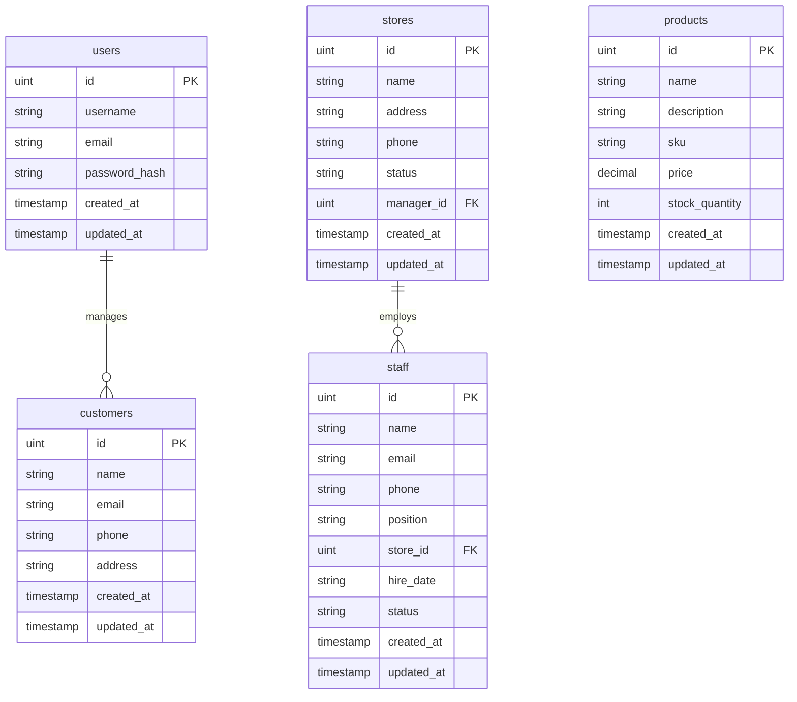

# CRMシステム 設計書

## 1. システム概要

### 1.1 目的
本CRMシステムは、企業の顧客管理、製品管理、店舗管理、スタッフ管理を統合的に行うWebアプリケーションです。効率的な業務運営と顧客満足度向上を支援します。

### 1.2 システム特徴
- **モダンアーキテクチャ**: Vue 3 + Go Echoによる高性能SPA
- **スケーラブル設計**: マイクロサービス指向のレイヤー分離
- **高品質保証**: 252個のテストケースによる包括的テスト
- **セキュア**: JWT認証とレート制限による安全性確保

### 1.3 対象ユーザー
- **管理者**: システム全体の管理・設定
- **マネージャー**: 店舗・スタッフ管理
- **スタッフ**: 顧客・製品情報の閲覧・編集

## 2. システムアーキテクチャ

### 2.1 全体構成
```
┌─────────────────┐    ┌─────────────────┐    ┌─────────────────┐
│   Frontend      │    │    Backend      │    │    Database     │
│   Vue 3 + TS    │◄──►│   Go + Echo     │◄──►│   MariaDB       │
│   Port: 5173    │    │   Port: 1323    │    │   Port: 3306    │
└─────────────────┘    └─────────────────┘    └─────────────────┘
```

### 2.2 技術スタック

#### フロントエンド
- **Vue.js 3**: Composition API採用
- **TypeScript**: 型安全性確保
- **Pinia**: 状態管理
- **Vue Router**: SPA ルーティング
- **Vite**: 高速ビルドツール
- **Vitest**: ユニットテスト

#### バックエンド
- **Go 1.25.1**: 高性能バックエンド言語
- **Echo v4**: 軽量Webフレームワーク
- **GORM**: ORM ライブラリ
- **JWT**: トークンベース認証
- **Testify**: テストライブラリ

#### データベース
- **MariaDB/PostgreSQL**: リレーショナルDB
- **自動マイグレーション**: GORM AutoMigrate

## 3. データベース設計

### 3.1 ER図


### 3.2 テーブル設計

#### users テーブル
| カラム名 | 型 | 制約 | 説明 |
|---------|---|-----|-----|
| id | UINT | PK, AUTO_INCREMENT | ユーザーID |
| username | VARCHAR(50) | UNIQUE, NOT NULL | ユーザー名 |
| email | VARCHAR(320) | UNIQUE, NOT NULL | メールアドレス |
| password_hash | VARCHAR(255) | NOT NULL | パスワードハッシュ |
| created_at | TIMESTAMP | NOT NULL | 作成日時 |
| updated_at | TIMESTAMP | NOT NULL | 更新日時 |

#### customers テーブル
| カラム名 | 型 | 制約 | 説明 |
|---------|---|-----|-----|
| id | UINT | PK, AUTO_INCREMENT | 顧客ID |
| name | VARCHAR(100) | NOT NULL, INDEX | 顧客名 |
| email | VARCHAR(320) | UNIQUE, NOT NULL | メールアドレス |
| phone | VARCHAR(50) | INDEX | 電話番号 |
| address | TEXT | | 住所 |
| created_at | TIMESTAMP | NOT NULL | 作成日時 |
| updated_at | TIMESTAMP | NOT NULL | 更新日時 |

#### products テーブル
| カラム名 | 型 | 制約 | 説明 |
|---------|---|-----|-----|
| id | UINT | PK, AUTO_INCREMENT | 製品ID |
| name | VARCHAR(200) | NOT NULL, INDEX | 製品名 |
| description | TEXT | | 説明 |
| sku | VARCHAR(100) | UNIQUE, INDEX | SKU |
| price | DECIMAL(10,2) | NOT NULL | 価格 |
| stock_quantity | INT | NOT NULL, DEFAULT 0 | 在庫数 |
| created_at | TIMESTAMP | NOT NULL | 作成日時 |
| updated_at | TIMESTAMP | NOT NULL | 更新日時 |

#### stores テーブル
| カラム名 | 型 | 制約 | 説明 |
|---------|---|-----|-----|
| id | UINT | PK, AUTO_INCREMENT | 店舗ID |
| name | VARCHAR(200) | NOT NULL, INDEX | 店舗名 |
| address | TEXT | NOT NULL | 住所 |
| phone | VARCHAR(50) | | 電話番号 |
| status | VARCHAR(20) | NOT NULL, DEFAULT 'active' | ステータス |
| manager_id | UINT | FK | 管理者ID |
| created_at | TIMESTAMP | NOT NULL | 作成日時 |
| updated_at | TIMESTAMP | NOT NULL | 更新日時 |

#### staff テーブル
| カラム名 | 型 | 制約 | 説明 |
|---------|---|-----|-----|
| id | UINT | PK, AUTO_INCREMENT | スタッフID |
| name | VARCHAR(100) | NOT NULL, INDEX | スタッフ名 |
| email | VARCHAR(320) | UNIQUE, NOT NULL | メールアドレス |
| phone | VARCHAR(20) | | 電話番号 |
| position | VARCHAR(50) | NOT NULL | 役職 |
| store_id | UINT | FK, INDEX | 店舗ID |
| hire_date | DATE | NOT NULL | 入社日 |
| status | VARCHAR(20) | NOT NULL, DEFAULT 'active' | ステータス |
| created_at | TIMESTAMP | NOT NULL | 作成日時 |
| updated_at | TIMESTAMP | NOT NULL | 更新日時 |

## 4. API設計

### 4.1 RESTful API 設計原則
- **リソース指向**: URL はリソースを表現
- **HTTPメソッド**: GET, POST, PUT, DELETE の適切な使用
- **ステータスコード**: 標準HTTPステータスコードの使用
- **JSON形式**: リクエスト・レスポンスはJSON

### 4.2 認証API

#### POST /api/auth/register
- **概要**: ユーザー登録
- **リクエスト**:
```json
{
  "username": "string",
  "email": "string",
  "password": "string"
}
```
- **レスポンス**:
```json
{
  "user": {
    "id": 1,
    "username": "string",
    "email": "string"
  },
  "token": "jwt_token"
}
```

#### POST /api/auth/login
- **概要**: ログイン
- **リクエスト**:
```json
{
  "email": "string",
  "password": "string"
}
```

### 4.3 管理API（認証必須）

#### 顧客管理API
- `GET /api/customers` - 顧客一覧取得（ページネーション・検索対応）
- `POST /api/customers` - 顧客作成
- `GET /api/customers/{id}` - 顧客詳細取得
- `PUT /api/customers/{id}` - 顧客更新
- `DELETE /api/customers/{id}` - 顧客削除

#### 製品管理API
- `GET /api/products` - 製品一覧取得
- `POST /api/products` - 製品作成
- `GET /api/products/{id}` - 製品詳細取得
- `PUT /api/products/{id}` - 製品更新
- `DELETE /api/products/{id}` - 製品削除
- `POST /api/products/{id}/stock` - 在庫調整
- `GET /api/products/stock/summary` - 在庫サマリー
- `GET /api/products/search/sku` - SKU検索

#### 店舗管理API
- `GET /api/stores` - 店舗一覧取得
- `POST /api/stores` - 店舗作成
- `GET /api/stores/{id}` - 店舗詳細取得
- `PUT /api/stores/{id}` - 店舗更新
- `DELETE /api/stores/{id}` - 店舗削除
- `POST /api/stores/{id}/status` - ステータス更新
- `GET /api/stores/status` - ステータス別店舗一覧
- `GET /api/stores/status/counts` - ステータス別件数
- `POST /api/stores/{id}/manager` - 管理者割り当て
- `DELETE /api/stores/{id}/manager` - 管理者割り当て解除
- `GET /api/stores/manager` - 管理者別店舗一覧
- `POST /api/stores/bulk/status` - ステータス一括更新
- `GET /api/stores/check/name` - 店舗名チェック

#### スタッフ管理API
- `GET /api/staff` - スタッフ一覧取得
- `POST /api/staff` - スタッフ作成
- `GET /api/staff/{id}` - スタッフ詳細取得
- `PUT /api/staff/{id}` - スタッフ更新
- `DELETE /api/staff/{id}` - スタッフ削除
- `POST /api/staff/{id}/status` - ステータス更新
- `POST /api/staff/{id}/store` - 店舗割り当て
- `DELETE /api/staff/{id}/store` - 店舗割り当て解除
- `GET /api/staff/status-counts` - ステータス別件数
- `GET /api/staff/unassigned` - 未割り当てスタッフ一覧
- `POST /api/staff/bulk-update-status` - ステータス一括更新
- `POST /api/staff/bulk-assign-store` - 店舗一括割り当て
- `GET /api/staff/search` - 名前検索

## 5. フロントエンド設計

### 5.1 コンポーネント構成
```
src/
├── components/
│   ├── common/          # 共通コンポーネント
│   │   ├── Modal.vue
│   │   └── ConfirmModal.vue
│   ├── customers/       # 顧客関連コンポーネント
│   │   └── CustomerFormModal.vue
│   ├── products/        # 製品関連コンポーネント
│   │   ├── ProductFormModal.vue
│   │   └── StockAdjustmentModal.vue
│   ├── StoreForm.vue    # 店舗フォーム
│   └── StaffForm.vue    # スタッフフォーム
├── views/               # ページコンポーネント
│   ├── customers/
│   │   ├── CustomerListView.vue
│   │   └── CustomerDetailView.vue
│   ├── products/
│   │   ├── ProductListView.vue
│   │   └── ProductDetailView.vue
│   ├── stores/
│   │   ├── StoreList.vue
│   │   └── StoreDetail.vue
│   └── staff/
│       └── StaffList.vue
├── stores/              # Pinia ストア
│   ├── auth.ts
│   ├── customer.ts
│   ├── product.ts
│   ├── store.ts
│   └── staff.ts
└── services/            # API サービス
    └── auth.ts
```

### 5.2 状態管理（Pinia）

#### 各ストアの責務
- **authStore**: 認証状態、ユーザー情報管理
- **customerStore**: 顧客データ、CRUD操作
- **productStore**: 製品データ、在庫管理
- **storeStore**: 店舗データ、ステータス管理
- **staffStore**: スタッフデータ、割り当て管理

### 5.3 ルーティング設計
```typescript
const routes = [
  { path: '/', name: 'Home', component: HomeView },
  { path: '/login', name: 'Login', component: LoginView },
  { path: '/customers', name: 'CustomerList', component: CustomerListView },
  { path: '/customers/:id', name: 'CustomerDetail', component: CustomerDetailView },
  { path: '/products', name: 'ProductList', component: ProductListView },
  { path: '/products/:id', name: 'ProductDetail', component: ProductDetailView },
  { path: '/stores', name: 'StoreList', component: StoreList },
  { path: '/stores/:id', name: 'StoreDetail', component: StoreDetail },
  { path: '/staff', name: 'StaffList', component: StaffList }
]
```

## 6. セキュリティ設計

### 6.1 認証・認可
- **JWT認証**: トークンベース認証システム
- **ミドルウェア**: 全保護ルートで認証チェック
- **トークン管理**: LocalStorageでの安全な保存
- **セッション管理**: トークン有効期限管理

### 6.2 セキュリティ機能
- **レート制限**: API呼び出し頻度制限
- **入力バリデーション**: フロントエンド・バックエンド両方
- **SQLインジェクション対策**: GORM による安全なクエリ
- **XSS対策**: Vue.js の自動エスケープ
- **CSRF対策**: SameSite Cookie 設定

### 6.3 パスワード管理
- **ハッシュ化**: bcrypt による安全なハッシュ
- **強度チェック**: 最小文字数・複雑性要件
- **リセット機能**: セキュアなパスワードリセット

## 7. パフォーマンス設計

### 7.1 データベース最適化
- **インデックス**: 検索頻度の高いカラムにインデックス作成
- **ページネーション**: 大量データの効率的な取得
- **N+1問題対策**: GORM Preload による関連データ取得

### 7.2 フロントエンド最適化
- **レイジーローディング**: ルートベースのコード分割
- **デバウンス**: 検索入力の最適化
- **キャッシュ**: API レスポンスの効果的なキャッシュ
- **仮想スクロール**: 大量データリスト表示の最適化

### 7.3 ネットワーク最適化
- **圧縮**: Gzip 圧縮によるデータ転送量削減
- **CDN**: 静的アセットの高速配信
- **HTTP/2**: 多重化による高速通信

## 8. テスト設計

### 8.1 テスト戦略
- **ユニットテスト**: 各コンポーネント・関数の単体テスト
- **統合テスト**: API とデータベースの統合テスト
- **E2Eテスト**: ユーザーシナリオの自動テスト
- **テストカバレッジ**: 90% 以上のカバレッジ目標

### 8.2 バックエンドテスト
```
models/
├── customer_test.go     # 顧客モデルテスト
├── product_test.go      # 製品モデルテスト
├── store_test.go        # 店舗モデルテスト
└── staff_test.go        # スタッフモデルテスト

handlers/
├── customer_test.go     # 顧客APIテスト
├── product_test.go      # 製品APIテスト
├── store_test.go        # 店舗APIテスト
└── staff_test.go        # スタッフAPIテスト

services/
└── staff_service_test.go # サービス層テスト
```

### 8.3 フロントエンドテスト
```
components/__tests__/
├── CustomerFormModal.test.ts
├── ProductFormModal.test.ts
├── StockAdjustmentModal.test.ts
├── StoreForm.test.ts
├── StaffForm.test.ts
└── ConfirmModal.test.ts

stores/__tests__/
├── customer.test.ts
├── product.test.ts
├── store.test.ts
└── staff.test.ts

views/__tests__/
├── ProductDetailView.test.ts
├── ProductListView.test.ts
└── StaffList.test.ts
```

## 9. 運用設計

### 9.1 ログ管理
- **アクセスログ**: 全API呼び出しの記録
- **エラーログ**: 例外・エラーの詳細記録
- **パフォーマンスログ**: 処理時間・DB クエリ記録
- **監査ログ**: データ変更の追跡記録

### 9.2 監視・アラート
- **ヘルスチェック**: サーバー稼働状況監視
- **メトリクス**: レスポンス時間・エラー率監視
- **リソース監視**: CPU・メモリ・ディスク使用量
- **アラート**: 異常検知時の自動通知

### 9.3 バックアップ・復旧
- **データベースバックアップ**: 定期的な自動バックアップ
- **設定ファイルバックアップ**: システム設定の保護
- **復旧手順**: 災害時の迅速な復旧プロセス
- **テストリストア**: 定期的な復旧テスト

## 10. 拡張性設計

### 10.1 水平スケーリング
- **ロードバランサー**: 複数インスタンス間の負荷分散
- **データベース分散**: 読み取り専用レプリカの活用
- **セッション管理**: Redis による分散セッション管理
- **キャッシュ層**: 分散キャッシュシステムの導入

### 10.2 機能拡張
- **プラグインアーキテクチャ**: 新機能の容易な追加
- **API バージョニング**: 後方互換性の維持
- **マイクロサービス化**: サービス単位での独立デプロイ
- **イベント駆動**: 非同期処理による性能向上

## 11. 品質保証

### 11.1 コード品質
- **静的解析**: ESLint, Go vet による品質チェック
- **型安全性**: TypeScript による型チェック
- **コードレビュー**: Pull Request による相互レビュー
- **継続的インテグレーション**: 自動テスト・ビルド

### 11.2 パフォーマンス品質
- **ロードテスト**: 高負荷時の性能検証
- **ストレステスト**: 限界性能の把握
- **メモリリーク検出**: 長期運用時の安定性確保
- **ベンチマーク**: 継続的な性能改善

## 12. デプロイメント

### 12.1 開発環境
- **Docker**: コンテナによる環境統一
- **docker-compose**: ローカル開発環境の簡単構築
- **ホットリロード**: 開発効率の向上
- **デバッグ**: 詳細なデバッグ情報提供

### 12.2 本番環境
- **Kubernetes**: コンテナオーケストレーション
- **CI/CD パイプライン**: 自動デプロイメント
- **ブルーグリーンデプロイ**: ダウンタイムなしデプロイ
- **ロールバック**: 問題発生時の即座な復旧

---

## 付録

### A. 用語集
- **CRM**: Customer Relationship Management（顧客関係管理）
- **SPA**: Single Page Application
- **JWT**: JSON Web Token
- **ORM**: Object-Relational Mapping
- **CRUD**: Create, Read, Update, Delete

### B. 参考文献
- [Vue.js 公式ドキュメント](https://vuejs.org/)
- [Echo フレームワークガイド](https://echo.labstack.com/)
- [GORM ドキュメント](https://gorm.io/)
- [JWT 仕様](https://jwt.io/)

### C. 変更履歴
| バージョン | 日付 | 変更内容 |
|----------|------|---------|
| 1.0 | 2024-09-26 | 初版作成 |